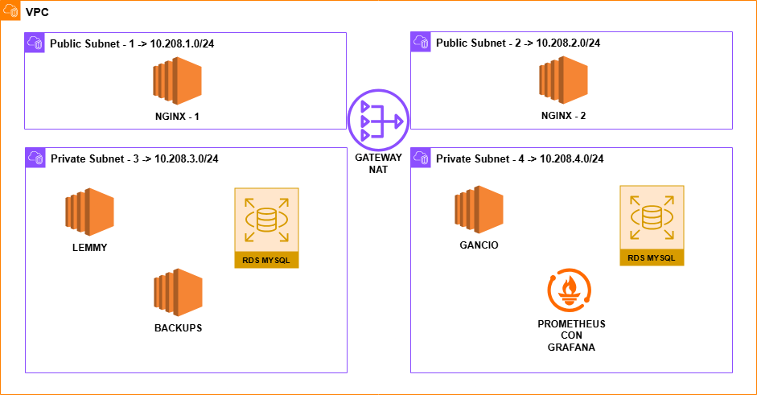

# 📌 Proyecto TFG - Implantación de Lemmy y Gancio en AWS

## 📖 Descripción
Este proyecto de Final de Grado (TFG) consiste en la implementación y configuración de Lemmy (una red social similar a Reddit) y Gancio (una plataforma de organización de eventos) en AWS.

Ambos servicios se desplegarán en un entorno seguro y escalable, con la integración de un sistema de notificaciones mediante un servidor de correo self-hosted para alertar a los usuarios sobre nuevos eventos. Además, se incorporará monitorización y medidas de seguridad avanzadas en toda la infraestructura, y se automatizará el despliegue con Terraform.

## 🎯 Objetivos
- Implementar **Lemmy** y **Gancio** en AWS utilizando **Docker Compose** y **instalación nativa**.
- Configurar bases de datos **MySQL en RDS** para ambas aplicaciones.
- Desplegar **Nginx** como proxy inverso para gestionar el tráfico y los certificados SSL.
- Automatizar la instalación mediante **Terraform**.
- Implementar un servicio de notificaciones por correo con un servidor de correo self-hosted con **PostFix**.
- Incorporar un sistema de monitorización con **Prometheus con Grafana**
- Implementar medidas de seguridad como firewall, reglas de seguridad estrictas.
- Realizar copias de seguridad automáticas de las bases de datos en otra instancia.

## 🏗️ Arquitectura del Proyecto



## 🛠️ Tecnologías Utilizadas
- **AWS** (EC2, RDS, VPC, Route 53)
- **Ubuntu Server** (para las instancias EC2)
- **Nginx** (proxy inverso y gestión de SSL)
- **MySQL y PostgreSQL en AWS RDS** (almacenamiento de datos)
- **Terraform** (automatización)
- **OpenMediaVault** (backups)
- **Prometheus con Grafana** (monitorización y visualización de recursos)
- **Postfix SMTP** (notificaciones de eventos por email)
- **Firewall y reglas IAM estrictas** (seguridad)

## 💡Costo Mensual Estimado en AWS (us-east-1)

| Componente         | Tipo/Detalle               | Cantidad | Costo/Hora | Costo/Mes (24/7) |
|--------------------|----------------------------|----------|------------|------------------|
| **EC2 Instances**  |                            |          |            |                  |
| NGINX-1 & NGINX-2  | `t2.micro`                 | 2        | $0.0116    | $16.70           |
| Lemmy              | `t3.medium`                | 1        | $0.0416    | $30.00           |
| Backups            | `t3.small`                 | 1        | $0.0208    | $15.00           |
| Gancio             | `t2.micro`                 | 1        | $0.0116    | $8.35            |
| Prometheus         | `t2.micro`                 | 1        | $0.0116    | $8.35            |
| **EBS Storage**    |                            |          |            |                  |
| Lemmy              | 50 GB (gp3)                | 1        | -          | $4.00            |
| Backups            | 80 GB total (gp3)          | 1        | -          | $6.40            |
| Gancio             | 30 GB (gp3)                | 1        | -          | $2.40            |
| **RDS Databases**  |                            |          |            |                  |
| PostgreSQL (Lemmy) | `db.t3.micro` + 20 GB      | 1        | $0.036     | $27.52           |
| MySQL (Gancio)     | `db.t3.micro` + 20 GB      | 1        | $0.036     | $27.52           |
| **Networking**     |                            |          |            |                  |
| NAT Gateway        | -                          | 1        | $0.045     | $32.85           |
| Data Transfer      | ~10 GB saliente            | -        | -          | $0.90            |

**Total Estimado:** $180 - $200 USD/mes  

### 1️⃣ Desplegar proyecto en AWS
```bash
git clone https://github.com/cfuentesc01/tfg-asir.git
cd tfg-asir
cd scripts
chmod +x terraform.sh
./terraform.sh
cd ..
terraform init
terraform plan
terraform apply
```
